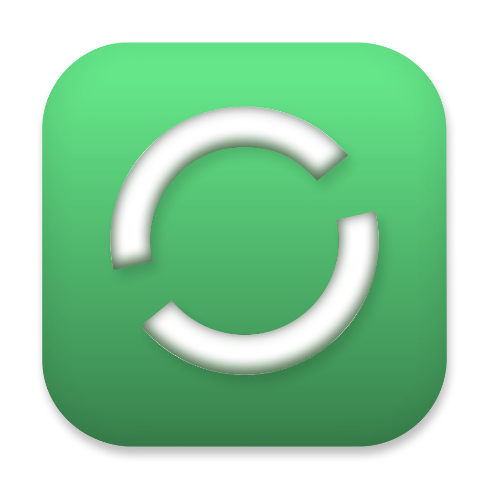

  

# OpenStore <small>_beta_</small>

## An open app store for macOS

OpenStore helps you find, install, and manage your favorite apps.

OpenStore **doesn't**:

- Restrict app features
- Process payments

OpenStore **does**:

- Give you a catalog of 3000+ apps at your fingertips
- Install, update, and uninstall apps with a single click
- Let you add your own source repositories (Coming soon)

<a href="https://getopenstore.app">Website</a> • <a href="https://github.com/GetOpenStore/homebrew-tap#install-openstore">Install</a>

## Tech

- [Electron](https://www.electronjs.org) and [electron-forge](https://www.electronforge.io)
- [Lit](https://lit.dev)
- [TypeScript](https://www.typescriptlang.org)
- [Bootswatch](https://bootswatch.com)
- [better-sqlite3](https://www.npmjs.com/package/better-sqlite3)
- [electron-store](https://github.com/sindresorhus/electron-store)
- Other wonderful libraries

In its current state, OpenStore can be accurately described as a GUI client for Homebrew. However, it may be extended in the future to work with other package managers, such as Chocolatey.

### Development

To develop OpenStore, use [Visual Studio Code](https://code.visualstudio.com/) (available on OpenStore!) with the following extensions:

- [Prettier - Code formatter](https://marketplace.visualstudio.com/items?itemName=esbenp.prettier-vscode) — you should set this up to run on file save for JS, TS, and HTML
- [Inline HTML](https://marketplace.visualstudio.com/items?itemName=pushqrdx.inline-html) — highlights and allows Prettier to format Lit's `html` and `css` template literals
- [vscode-sql-template-literal](https://marketplace.visualstudio.com/items?itemName=forbeslindesay.vscode-sql-template-literal) — highlights `sql` template literals

Clone this repository and run `npm i` to install packages.

Use `npm start` to build and run the app in dev/debug mode. Hot reload doesn't work correctly at the moment, so you should quit the app and re-run `npm start` when you make changes.

To package a release, use `npm run make-for-arm64` for arm64 ("Apple silicon") and `npm run make-for-x86_64` for x86_64 ("Intel").

## Bugs and feature requests

If you encounter a bug or would like to request a feature, please check the [issues page](https://github.com/GetOpenStore/OpenStore/issues) for a similar report, or open a new issue if you can't find one. Also, please understand that some feature requests may be declined or put on the backburner.
